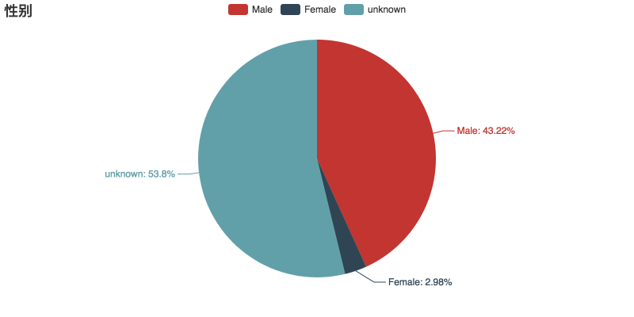
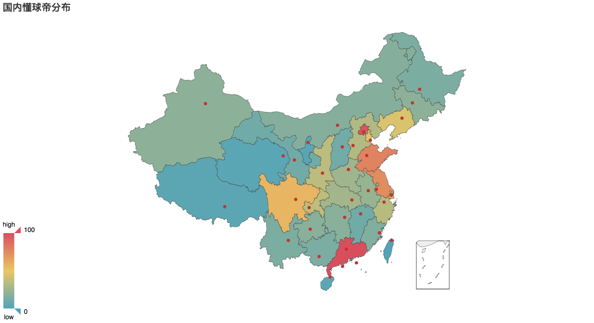
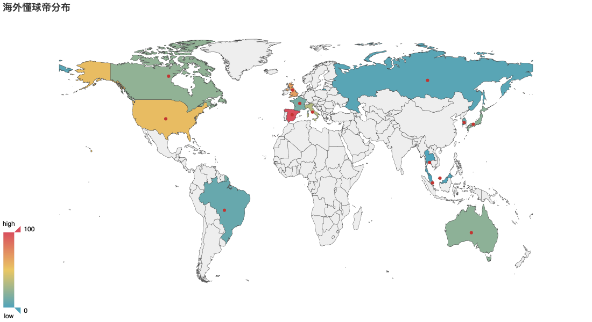
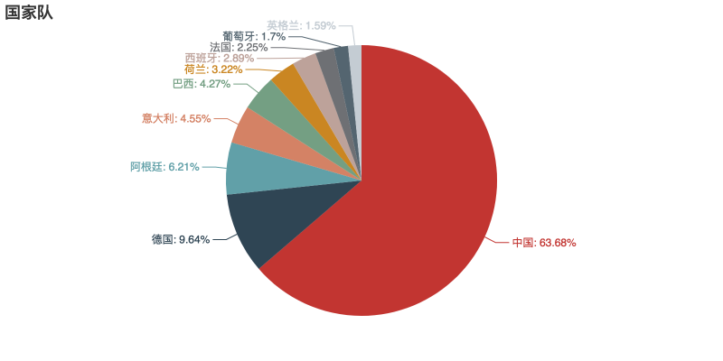
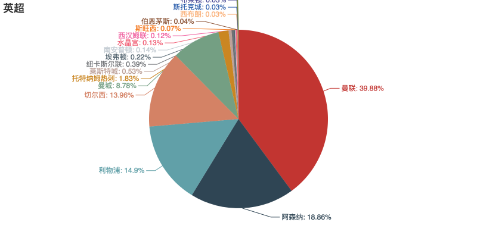
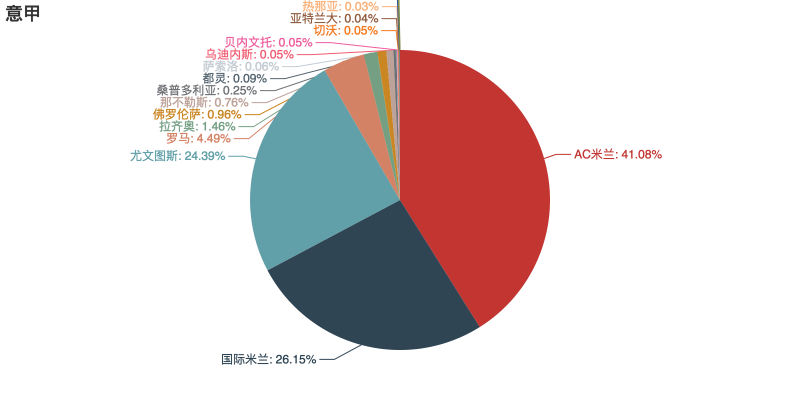
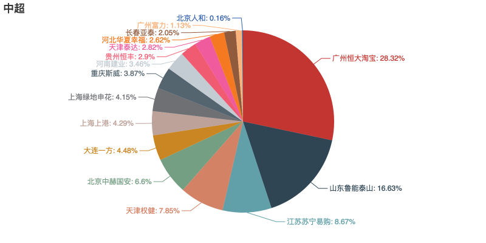
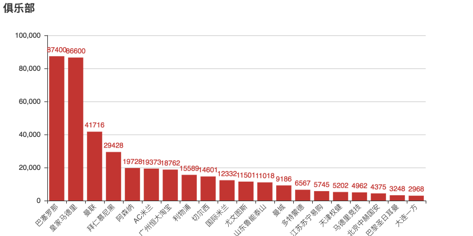
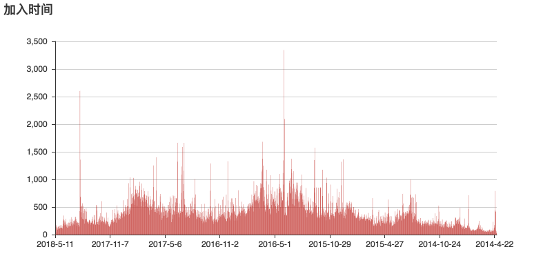

# Dongqiudi

这是对"懂球帝"App的数据爬虫与分析。

**技术栈：**

首先使用 **软件Charlse** 抓包懂球帝App的各个API:

1. 球队信息API： http://api.dongqiudi.com/catalogs 和  http://api.dongqiudi.com/catalog/channels/{id}
2. 获取 Article ID 的 API: http://api.dongqiudi.com/app/tabs/iphone/1.json
3. 获取评论用户的API： http://api.dongqiudi.com/v2/article/{article_id}/comment?sort=down&version=600
4. 获取用户信息的API：https://api.dongqiudi.com/users/profile/{}

先获取最近5000页的10w篇article，然后获取这些article评论区的用户，再爬取这些用户的个人数据。

使用 **Requests** 库来爬取数据，其中爬取评论区的用户ID时间比较长，而且只能串行不可并行，需要有断点继续机制。爬取到60w用户ID后，可以并行来获取这些用户的个人数据。

所有数据存储在本地的sqlite3数据库中。

使用PyEcharts来进行数据可视化，其中分词部分使用[jieba](https://github.com/fxsjy/jieba)。

----

### 1. 数据准备

将所有数据存储在 sqlite3 中。

数据包括：

1. 球队信息列表。

- 共 **144** 个球队，存储在 team 表。

2. 近期的文章列表。

- 一共提取了最近 5000 页的 **99889** 篇文章。

3. 用户id列表。

- 99889 篇文章下的(约) **5891037** 个评论用户(未去重)，存储在 article_comment_user 表。

4. 用户信息。

- 去重后共 **610803** 个用户，存储在 user 表。 (去重去掉了90%...)

----

### 2. 数据分析结果

1. There are 51828 male users, 3292 female users, and 48180 users gender unknown.

2. Top 10 Region:

| Region | Count |
| :----: | :---: |
| 广东 广州  | 10287 |
| 四川 成都  | 8446  |
| 北京 东城区 | 6960  |
| 海外 其他  | 6866  |
| 陕西 西安  | 6469  |
| 江苏 南京  | 6452  |
| 辽宁 大连  | 5662  |
| 北京 海淀区 | 5163  |
| 山东 济南  | 4884  |
| 广东 深圳  | 4827  |
| 湖北 武汉  | 4566  |

3. Top 10 club team:

|  Team  | Count |
| :----: | :---: |
|  巴塞罗那  | 87400 |
| 皇家马德里  | 86600 |
|   曼联   | 41716 |
| 拜仁慕尼黑  | 29428 |
|  阿森纳   | 19728 |
|  AC米兰  | 19373 |
| 广州恒大淘宝 | 18762 |
|  利物浦   | 15589 |
|  切尔西   | 14601 |
|  国际米兰  | 12332 |

4. Top 5 national team:

| Team | Count |
| :--: | :---: |
|  中国  | 24134 |
|  德国  | 3655  |
| 阿根廷  | 2354  |
| 意大利  | 1723  |
|  巴西  | 1617  |

----

### 3. 数据可视化

使用 [**PyEcharts**](https://github.com/pyecharts/pyecharts)，强烈推荐。

3.1 性别

3.2 国内分布

3.3 海外分布

3.4 国家队

3.5 英超

3.6 意甲

3.7 中超

3.8 俱乐部

3.9 名字词云

3.10 加入时间

